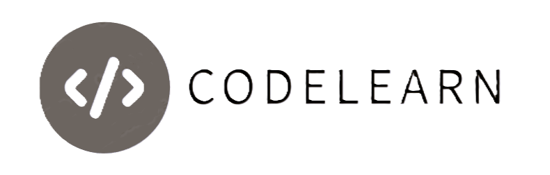
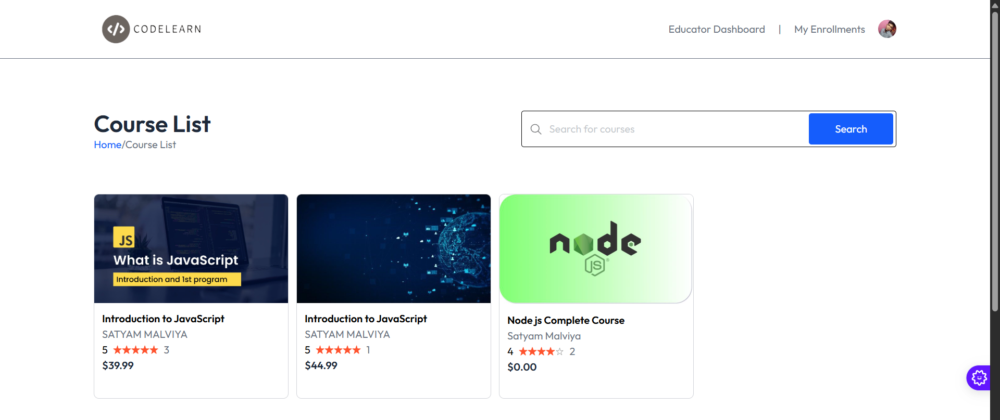
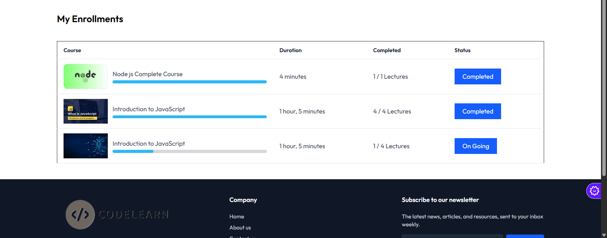
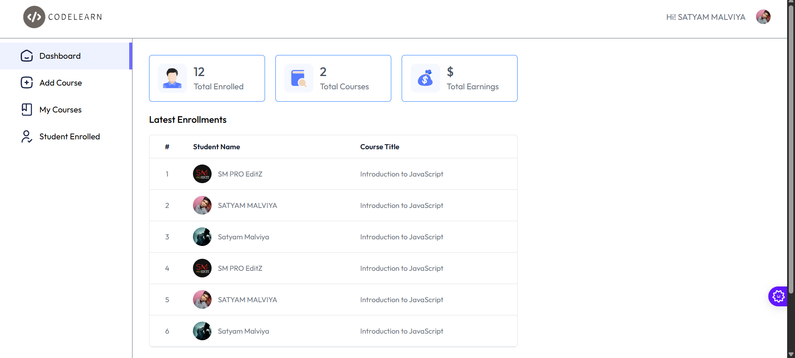
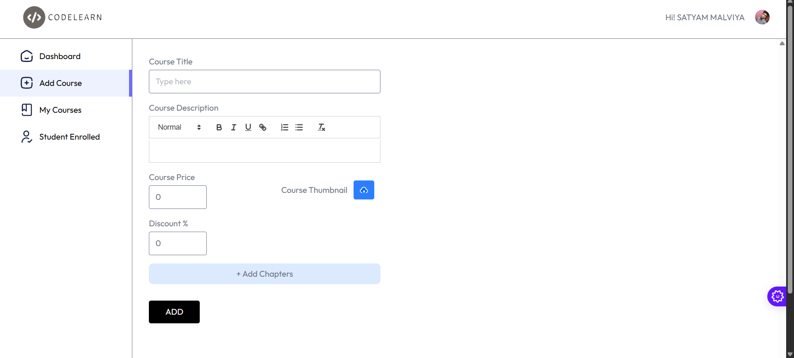

# CodeLearn LMS Platform

A modern Learning Management System (LMS) built with **React**, **Vite**, **TailwindCSS**, and **Clerk authentication**.  

## Get Started 🚀

> []()
> []()
> []()
> []()


## Screens
> 
> 
> 
> 
> 


## 🚀 Features

- **User Authentication** via [Clerk](https://clerk.dev/)  
- **Modern UI** with TailwindCSS 4  
- **Rich Text Editor** using Quill  
- **Video Lessons** via React YouTube  
- **Progress Tracking** with rc-progress  
- **Notifications** using React Toastify  
- **Fast development with Vite**  
- **Fully modular components** for scalability  

---

## 📂 Tech Stack

**Frontend:** React 19, Vite 7  
**Backend:** MongoDB, Express, JWT
**Styling:** TailwindCSS 4, UnoCSS, PostCSS  
**Auth:** Clerk  
**Editor:** Quill  
**Other Utilities:** Axios, humanize-duration, uniqid  

---

## 🛠 Installation

Clone the repo and install dependencies:

```bash
git clone https://github.com/satyammalviya15/codelearn.git
cd codelearn
npm install
